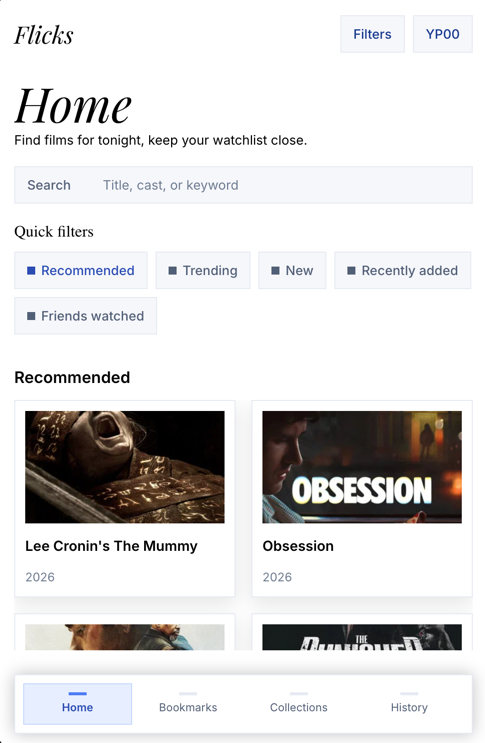
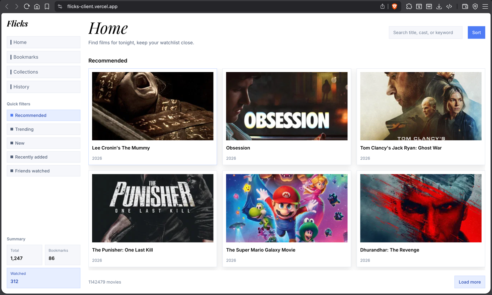

# Flicks

A full-stack film library pet project built with **Vue 3**, **TypeScript**, **Go**, and **TMDB**.

Flicks is a movie browsing app with a custom responsive UI, a Go backend acting as a BFF/proxy over TMDB, global search, quick feeds, sorting, pagination, and movie details.

## Features

* Mobile-first responsive interface
* Light theme design implementation from Penpot
* Movie feed powered by TMDB
* Global movie search
* Quick feeds:

  * Recommended
  * Trending
  * New
* Sorting:

  * Recommended
  * Newest
  * Rating
  * Title A-Z
* Load more pagination
* Movie details page
* Go backend proxy to keep TMDB credentials server-side
* Frontend API state isolated in composables
* Clean separation between API layer, composables, views, and reusable UI components

## Screenshots

Screenshots can be added after final UI polish.




## Tech Stack

### Frontend

* Vue 3
* TypeScript
* Vite
* Vue Router
* Pinia
* SCSS/Sass
* ofetch

### Backend

* Go 1.22
* Standard library `net/http`
* TMDB API integration
* Project-owned DTOs and response mapping
* CORS middleware
* Environment-based configuration

## Project Structure

```txt
.
├── client/                 # Vue/Vite frontend
│   ├── src/
│   │   ├── api/            # Pure API request functions
│   │   ├── components/     # Base, common, and app components
│   │   ├── composables/    # Stateful frontend logic
│   │   ├── content/        # Static UI content
│   │   ├── layouts/        # App layout components
│   │   ├── router/         # Vue Router setup
│   │   ├── styles/         # SCSS tokens, layouts, components
│   │   ├── types/          # Shared frontend types
│   │   └── views/          # Route views
│   └── package.json
│
├── server/                 # Go backend
│   ├── cmd/api/            # Local API entrypoint
│   ├── internal/
│   │   ├── app/            # Application wiring
│   │   ├── config/         # Environment configuration
│   │   ├── http/           # Router, handlers, middleware
│   │   └── movies/         # Movie DTOs, TMDB client, mappers
│   └── go.mod
│
├── scripts/
│   └── dev.sh              # Starts backend and frontend locally
│
└── .env.example
```

## API Routes

The frontend talks only to the local Go API. TMDB credentials are never exposed to the browser.

### Health

```http
GET /health
```

### Movie feeds

```http
GET /movies/feed?type=recommended&page=1
GET /movies/feed?type=trending&page=1
GET /movies/feed?type=new&page=1
```

### Search

```http
GET /movies/search?query=avatar&page=1
```

### Sorting / discover

```http
GET /movies/discover?sortBy=recommended&page=1
GET /movies/discover?sortBy=newest&page=1
GET /movies/discover?sortBy=rating&page=1
GET /movies/discover?sortBy=title-az&page=1
```

### Movie details

```http
GET /movies/{id}
```

Example:

```http
GET /movies/550
```

## Environment Variables

Create a local `.env` file based on `.env.example`.

```env
# TMDB
TMDB_API_BASE_URL=https://api.themoviedb.org/3
TMDB_IMAGE_BASE_URL=https://image.tmdb.org/t/p
TMDB_BEARER_TOKEN=

# VITE
VITE_APP_API_URL=http://localhost:8080
VITE_APP_WS_URL=
VITE_APP_API_BEARER=
```

`TMDB_BEARER_TOKEN` must be a TMDB API Read Access Token.

Do not commit real `.env` files or real tokens.

## Local Development

Install frontend dependencies:

```bash
cd client
pnpm install
```

Run the full app from the repository root:

```bash
pnpm dev
```

Or run services separately.

Backend:

```bash
cd server
go run ./cmd/api
```

Frontend:

```bash
cd client
pnpm dev
```

Default local URLs:

```txt
Frontend: http://localhost:5173
Backend:  http://localhost:8080
```

## Validation

Frontend:

```bash
cd client
pnpm lint
pnpm build
```

Backend:

```bash
cd server
go test ./...
```

## Deployment Notes

The recommended deployment setup is two separate projects from the same monorepo:

```txt
flicks-client  → root directory: client
flicks-api     → root directory: server
```

Frontend environment:

```env
VITE_APP_API_URL=https://your-api-domain
```

Backend environment:

```env
TMDB_API_BASE_URL=https://api.themoviedb.org/3
TMDB_IMAGE_BASE_URL=https://image.tmdb.org/t/p
TMDB_BEARER_TOKEN=your-secret-token
```

Keep `TMDB_BEARER_TOKEN` only in deployment environment variables, not in the repository.

## Why This Project Exists

Flicks is a portfolio-oriented full-stack project. The goal is to demonstrate:

* building a custom responsive frontend from a design file;
* structuring a Vue app with reusable components and composables;
* writing a Go backend with clean API boundaries;
* integrating with a third-party API safely through a backend proxy;
* mapping external API responses into project-owned DTOs;
* handling search, sorting, feeds, pagination, loading states, and details pages.

## License

This is a personal pet project.
